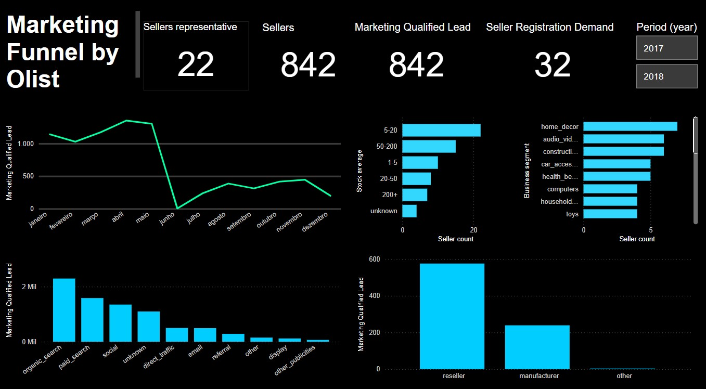

# Marketing Funnel by Olist

The "Marketing Funnel Olist" dataset contains information about the sales funnel of Olist, a Brazilian e-commerce platform.
Useful for analyzing how leads (potential customers) convert into closed deals.

## 🔍 About the Dataset
The dataset includes information on:
✔️ Lead generation
✔️ Sales funnel stages
✔️ Deal closures

These data points can be used for statistical analysis, predictive modeling, and marketing strategy optimization.

## 📂 Available at: Kaggle - Marketing Funnel Olist